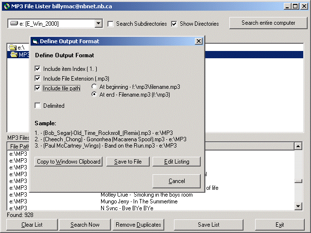



## MP3 File Lister/Search Engine

### Description

Recursive search a directory, entire drive or entire computer for MP3 files. Output to clipboard, or file as text or delimited.
 
### More Info
 

             |
---                |---
**Submitted On**   |2000-10-29 22:08:50
**By**             |[Bill MacIntyre](https://github.com/Planet-Source-Code/PSCIndex/blob/master/ByAuthor/bill-macintyre.md)
**Level**          |Beginner
**User Rating**    |4.7 (14 globes from 3 users)
**Compatibility**  |VB 6\.0
**Category**       |[Sound/MP3](https://github.com/Planet-Source-Code/PSCIndex/blob/master/ByCategory/sound-mp3__1-45.md)
**World**          |[Visual Basic](https://github.com/Planet-Source-Code/PSCIndex/blob/master/ByWorld/visual-basic.md)
**Archive File**   |[CODE\_UPLOAD1110910292000\.zip](https://github.com/Planet-Source-Code/bill-macintyre-mp3-file-lister-search-engine__1-12398/archive/master.zip)

